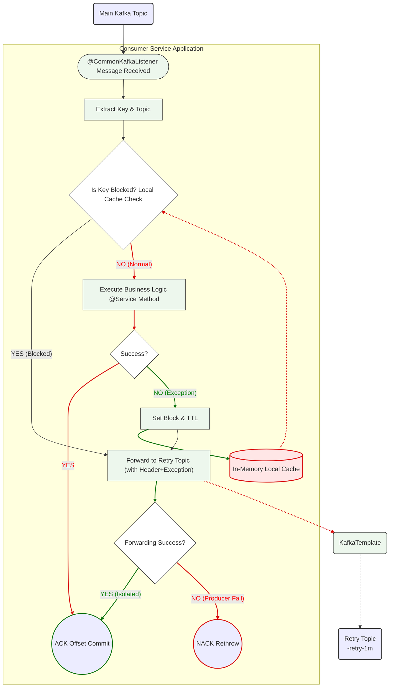

#### Spring Boot 환경에서 Kafka 컨슈머의 장애 격리(Resiliency) 및 순서 보장(Ordering)을 쉽고 안전하게 구현할 수 있도록 지원하는 라이브러리
- **장애 격리 및 복구 (Resiliency)**: 비즈니스 로직 실패 시 즉시 재시도 토픽으로 메시지를 대피(Forwarding)시켜 메인 컨슈머의 지연(Lag)을 방지하고 시스템 안정성을 확보
- **데이터 순서 보장 (Ordering)**: 분산 환경에서 특정 Key 처리가 실패했을 때, 로컬 캐시 기반의 Blocking 을 통해 후속 메시지의 순서가 뒤바뀌는 것을 방지
- **개발 생산성 향상**: 복잡한 `try-catch`, 재시도 발송, 순서 제어 로직을 `@CommonKafkaListener` 어노테이션 하나로 추상화하여 비즈니스 로직에 집중할 수 있도록 지원

---

### 🚀 퀵 스타트

#### 1. Gradle 의존성 추가
프로젝트의 `build.gradle` 파일에 아래 의존성을 추가

```gradle
dependencies {
    implementation 'com.common:common-kafka:1.0.0'
    implementation 'org.springframework.kafka:spring-kafka'
}
```

#### 2. application.yml 설정

```yaml
spring:
  kafka:
    bootstrap-servers: {kafka host}:9092

    consumer:
      group-id: {service-group-id}
      key-serializer: org.apache.kafka.common.serialization.StringSerializer
      value-serializer: org.springframework.kafka.support.serializer.JsonSerializer
      properties:
        spring.json.trusted.packages: "*" # DTO 변환 허용 패키지

```

#### 3. @CommonKafkaListener 작성
기존 `@KafkaListener` 대신 사용하여 장애 격리 기능을 적용합니다.

```java
@Component
public class OrderEventListener {
    // 기존 @KafkaListener 와 사용법 동일
    @CommonKafkaListener(topics = "order-events", groupId = "order-group")
    public void onMessage(ConsumerRecord<String, OrderDto> record) {
        // ... 비즈니스 로직
        // 예외(Exception) 발생 시 라이브러리가 자동으로 감지하여 처리
    }
}
```

---

#### 🛠 상세 기능

#### 1. 자동 장애 격리 (Auto Failover)
메서드 실행 중 예외가 발생했을 때의 동작입니다.  
동작 효과: 장애가 발생한 메시지 때문에 파티션 전체가 막히는(Head-of-Line Blocking) 현상을 방지

```
1. Exception 감지
2. Retry Topic 으로 메시지 원본(Header 포함) 복사 및 전송
3. 현재 Offset Commit (성공 처리)
```

#### 2. 순서 보장 매커니즘 (Ordering)
특정 Key(예: User_A)의 메시지가 실패했을 때 해당 Key의 후속 메시지 처리를 제어

#### 동작 원리 (Local Blocking)
동작 결과: 실패한 메시지와 후속 메시지들이 모두 재시도 대기열에 순서대로 쌓이게 되어 데이터 정합성을 보장
```
1. User_A의 메시지가 실패하면 해당 서버의 로컬 메모리에 User_A를 잠시 차단(Block) 상태로 기록
2. 이후 들어오는 User_A의 후속 메시지들은 비즈니스 로직을 타지 않고 즉시 Retry Topic 으로 우회
3. 설정된 `blocking-ttl-seconds` (기본 70초) 동안 이 상태가 유지
```

#### 3. Resiliency Architecture (안전 장치)
Kafka 장애나 네트워크 이슈 등 극한 상황에서도 서비스 가용성을 유지하기 위한 설계

#### Zero Dependency
Redis, DB 등 외부 저장소를 사용하지 않고 Java `ConcurrentHashMap`을 사용하여 구현했습니다. 외부 인프라 장애가 이 라이브러리의 동작에 영향을 주지 않습니다.

#### Fail-Safe (전송 실패 시)
만약 Retry Topic으로의 메시지 전송(Producer send)마저 실패한다면?
*   이 경우 원본 예외(Original Exception)를 다시 던져(Rethrow) Kafka가 Offset 을 Commit 하지 못하게 막습니다
*   이를 통해 데이터 유실(Data Loss)을 방지하고 Kafka의 기본 재시도 메커니즘을 따르게 합니다

#### Header Preservation
메시지를 재전송할 때 Trace ID, Auth Token 등 원본 헤더를 모두 복사하며 추가로 `x-exception-msg` 등 디버깅 정보를 헤더에 포함시킵니다.




이 다이어그램은 하나의 메시지가 들어왔을 때의 처리 과정을 나타냅니다.
1. 수신 및 확인: 메시지가 들어오면 가장 먼저 로컬 캐시(In-Memory)를 확인하여 해당 Key가 현재 차단(Blocking) 상태인지 확인합니다.
2. 순서 보장 (Blocking): 이미 선행 메시지가 실패하여 차단된 상태라면 비즈니스 로직을 실행하지 않고 즉시 재시도 토픽으로 우회(Forwarding) 시킵니다.
3. 로직 실행 및 실패 감지: 정상 상태라면 비즈니스 로직을 수행합니다. 수행 중 예외(Exception)가 발생하면 이를 감지합니다.
4. 장애 격리 (Resiliency): 예외 발생 시 로컬 캐시에 해당 Key를 차단 상태로 설정하고, 메시지를 재시도 토픽으로 발송합니다.
5. 안전 장치 (Fail-Safe): 만약 재시도 토픽으로의 발송마저 실패할 경우(가장 오른쪽 하단 분기), 원본 예외를 다시 던져(Rethrow) Kafka가 메시지 처리를 실패로 인식하게 하여 데이터 유실을 방지합니다.
